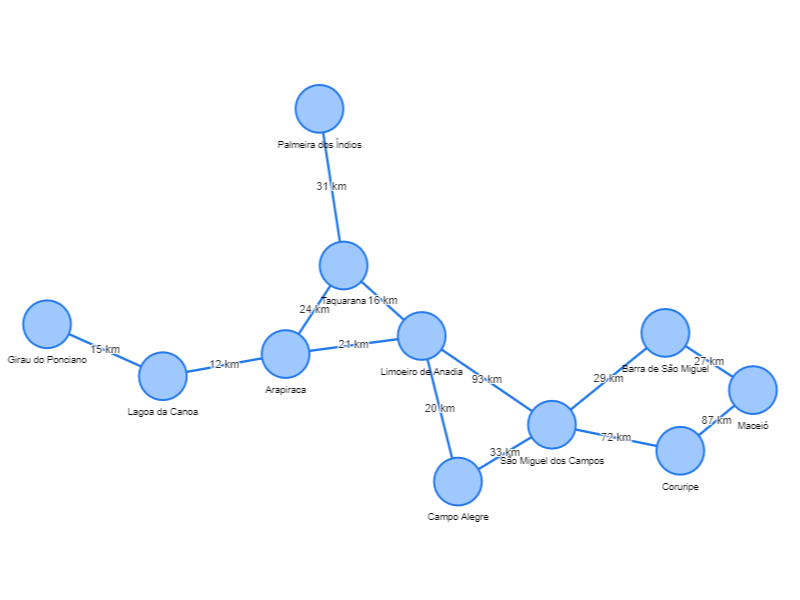

# Menor Caminho entre Cidades

Este é um aplicativo web que calcula o menor caminho entre cidades usando o algoritmo de Dijkstra. Ele permite que os usuários selecionem duas cidades e exibe o menor caminho e a distância total em quilômetros.

## Como usar

1. Abra o arquivo `index.html` em um navegador da web.
2. Selecione a cidade de origem no campo "De".
3. Selecione a cidade de destino no campo "Para".
4. Clique no botão "Calcular menor caminho".
5. O resultado será exibido abaixo, mostrando o menor caminho e a distância total.

## Exemplo



## Personalização

Você pode personalizar o grafo de cidades e as conexões editando o arquivo `script.js`. O grafo é representado por um objeto JavaScript com as seguintes propriedades:

```javascript
const graph = {
  nodes: [
    { id: 1, label: "Cidade 1" },
    { id: 2, label: "Cidade 2" },
    // Adicione mais cidades aqui...
  ],
  edges: [
    { from: 1, to: 2, label: "10 km" },
    { from: 1, to: 3, label: "15 km" },
    // Adicione mais conexões aqui...
  ],
};
```
## Links uteis

Visualiazação do grafo: https://luckas-ferreira.github.io/Teoria-dos-Grafos/

Slider:  https://docs.google.com/presentation/d/1W3lpCens9wQurm2pMArrplW3w-3iGQLQSxHr_HnHpf8/edit?usp=sharing

Vídeo Explicativo: https://youtu.be/ejxflXf7I9I

### Autores
---

<a href="https://github.com/Luckas-Ferreira">
 
 <br />
 <sub><b>Luckas Ferreira</b></sub></a> <a href="https://github.com/Luckas-Ferreira" title="Sistema Logístico - POO">🚀</a>

<a href="https://instagram.com/luckas_.ferreira" target="_blank"></a>
  
 <br />

<a href="https://github.com/jrobertogram">
 
 <br />
 <sub><b>Roberto</b></sub></a> <a href="https://github.com/jrobertogram" title="Sistema Logístico - POO">🚀</a>

<a href="https://instagram.com/jrobertogram" target="_blank"></a>
  
